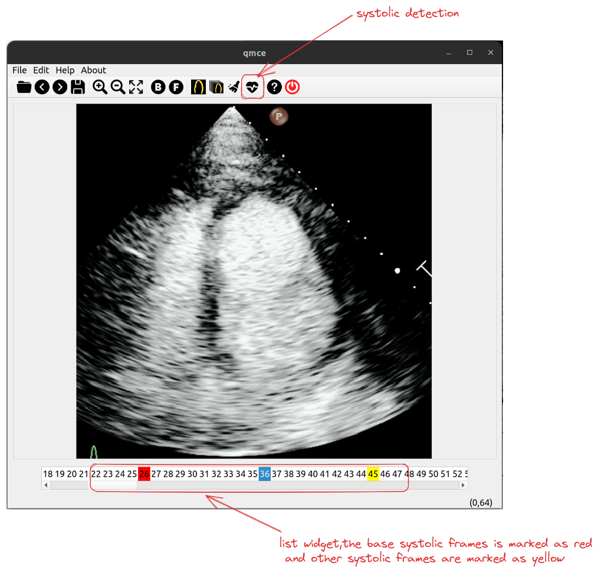
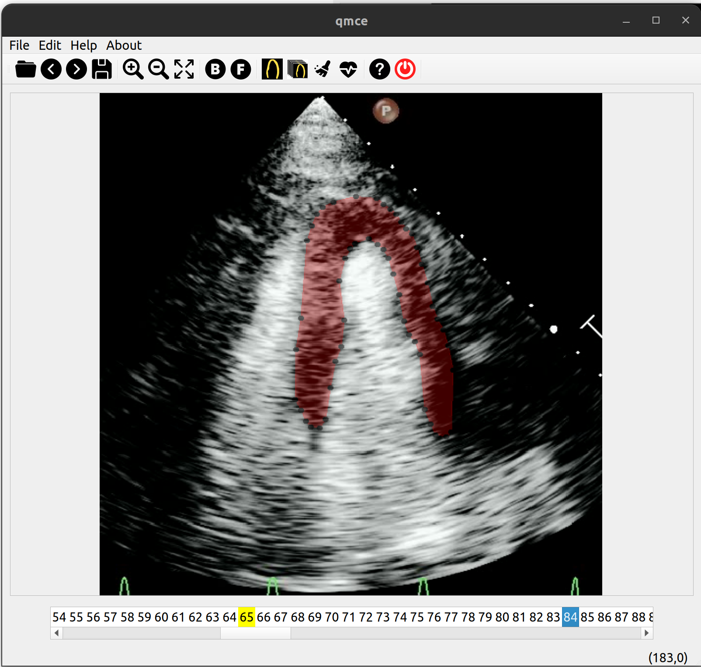

# introduction
mce analysis using Qt/c++ 
# installation 
## pybind11
```bash
git submodule add git@github.com:pybind/pybind11.git submodule/pybind11
cd submodule/pybind11
git submodule update --init --recursive
```
## download model files
download model files: seg.onnx and phase.onnx

link:
https://drive.google.com/drive/folders/19nHk73i5XrVEX6mqN87iUjEbr8oiWs1P?usp=sharing
# features
## automatically select systolic frames
after select the base systolic frame, press "systolic detection" button, choice desired number of frames, the app will select systolic frames after base systolic frame,
the base systolic frames is marked as red in the list widget, and other systolic frames are marked as yellow in the list widget

## automatically segment myocardium
after the selection of systolic frames, press "segment all selected frames" to apply segmentation algorithm to all selected frames and adjust the points with your mouse.


## calculate myocardial perfusion parameters(still in developing)
still in developing 


# demostration video
[demo.webm](res/imgs/demo.webm)