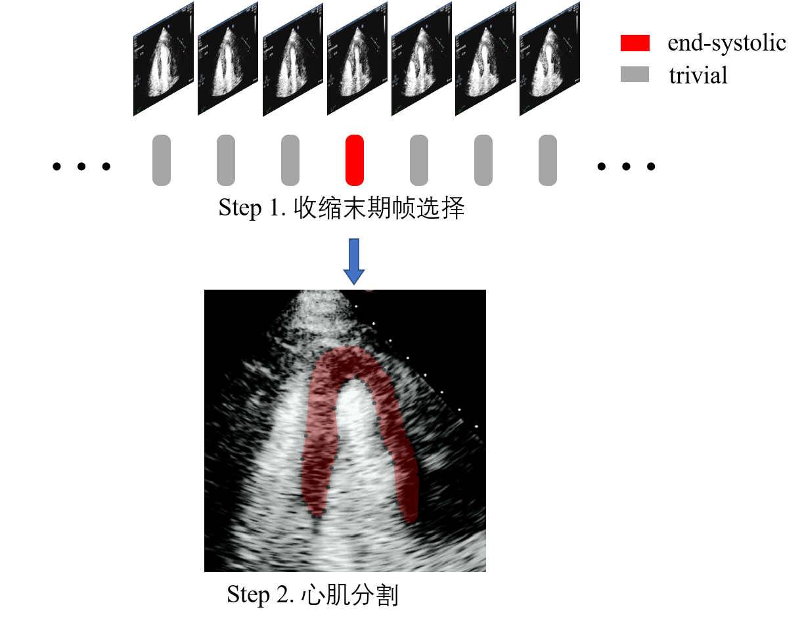
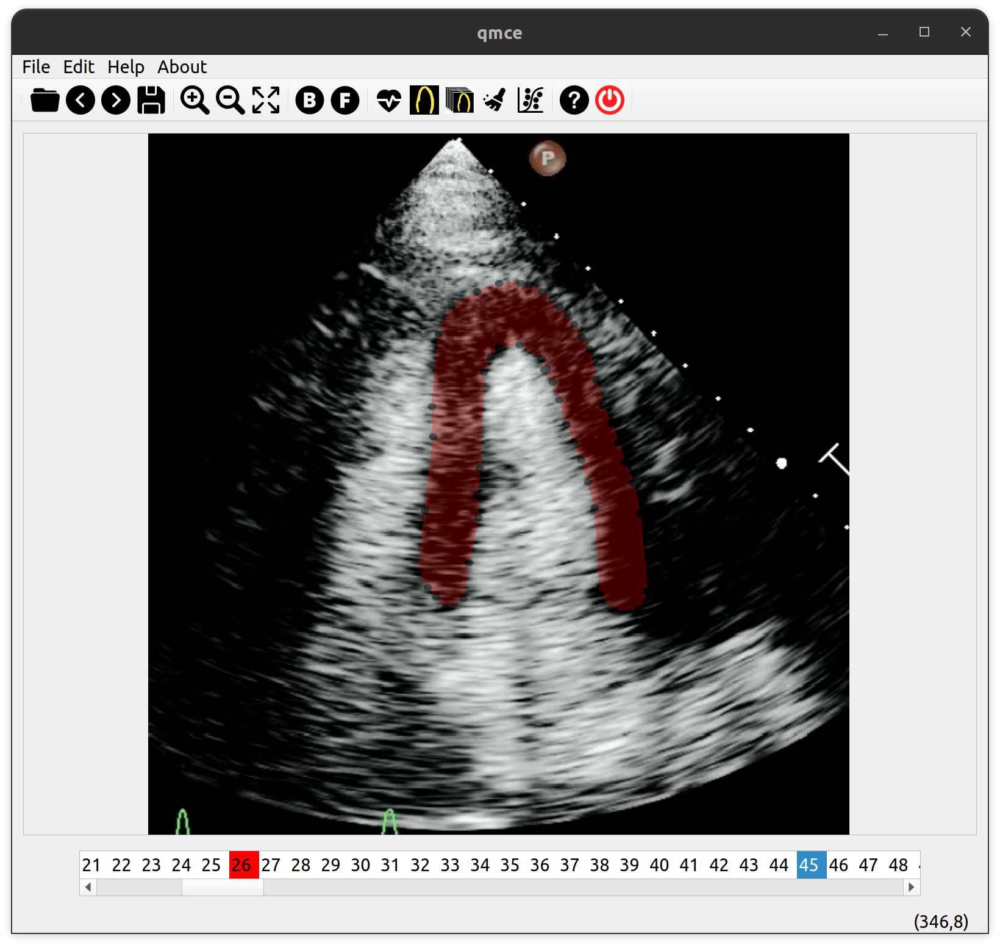
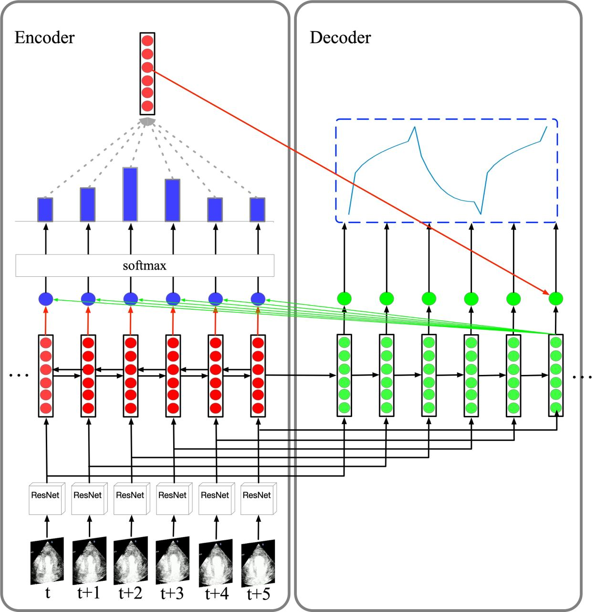
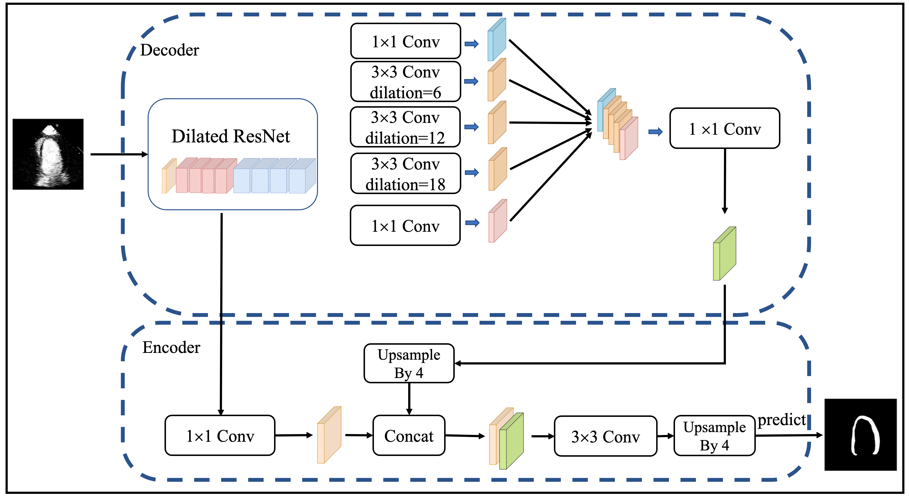
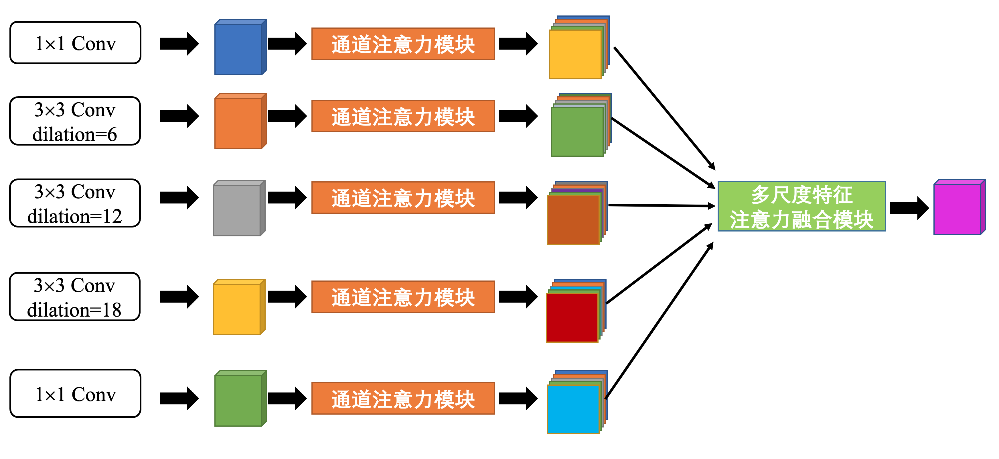

# introduction
 Myocardial Contrast Echocardiography (MCE) serves as a valuable, non-invasive tool for perfusion evaluation, offering cost-effectiveness, radiation avoidance, and bedside applicability.




MCE perfusion parameters needs two crucial steps: the selection of the end-systolic frame and subsequent segmentation of the myocardium in that frame. It can be asserted that the precise selection of the end-systolic frame and the segmentation of the myocardium are essential prerequisites for the dependable estimation of perfusion parameters.  the absence of automated technologies and software has resulted in protracted manual annotation and analysis times, significantly constraining its clinical applicability. Moreover, the manual annotation of MCE exhibits limited reproducibility, relying substantially on the clinical expertise of practitioners. Hence, the development of automated methodologies for the computation of MCE myocardial perfusion parameters holds paramount significance

The MCE Automated Analysis Software is an interactive tool developed to streamline the analysis of myocardial purfusion parameters in contrast echocardiography (MCE) data. It automates key processes such as end-systolic frame selection, myocardial segmentation, and calculation of myocardial perfusion parameters.

## end-systolic frame detection algorithmn
The MCE Automated Analysis Software utilizes a Seq2Seq architecture with Convolutional Neural Networks (CNNs), Long Short-Term Memory (LSTM) networks, and an attention mechanism for end-systolic frame recognition. This model effectively identifies end-systolic frames in MCE sequences by capturing spatial and temporal information.

**github repo**: https://github.com/chx9/mcephase


## myocardial segmentation algorithm:
The Myocardial Segmentation Algorithm in the MCE Automated Analysis Software is based on the DeepLabv3+ model, which is known for its accurate pixel labeling capabilities. To further enhance the model's performance, the algorithm incorporates a Channel Attention Module and a Multi-Scale Feature Attention Aggregation Module. These modules enable the model to selectively emphasize informative features and capture correlations across different scales, resulting in improved segmentation accuracy.



**github repo**: https://github.com/chx9/mceseg
# features
## automatically select systolic frames
After selecting the initial systolic frame, click the "Systolic Detection" button. Choose the preferred number of frames, and the application will automatically identify systolic frames following the base systolic frame.

The base systolic frame is distinguished by a red marker in the list widget and other systolic frames are highlighted with a yellow marker within the list widget.
## automatically segment myocardium
Following the selection of systolic frames, click on "Segment All Selected Frames" to activate the segmentation algorithm across the chosen frames. Refine the points using your mouse for precise adjustments.
## calculate myocardial perfusion parameters
after ES selection and myocardium segmentation, click  "Regression" button, qmce will perform myocardial perfusion parameter calculation.the 17-segment model is employed for assessment. The primary distinction between the 17-segment and the previously utilized 16-segment model lies in the inclusion of an additional  segment, known as the apical cap. This modification provides a more comprehensive representation of myocardial anatomy and function.
According to the American Society of Echocardiography, the clinical application of the 17-segment model is predominant in evaluating myocardial perfusion. 


once click the "Regression" button, the results of 7 segments will pop out, it will calculate the A:plateau image intensity, $\beta$:myocardial blood flow velocity and MBF:myocardial blood flow and the R-squared of the regression


## actions

<!-- # demostration video
[demo.webm](res/imgs/demo.webm) -->
# installation 
## pybind11
```bash
git submodule add git@github.com:pybind/pybind11.git submodule/pybind11
cd submodule/pybind11
git submodule update --init --recursive
```
## download model files
download model files: seg.onnx and phase.onnx

link:
https://drive.google.com/drive/folders/19nHk73i5XrVEX6mqN87iUjEbr8oiWs1P?usp=sharing